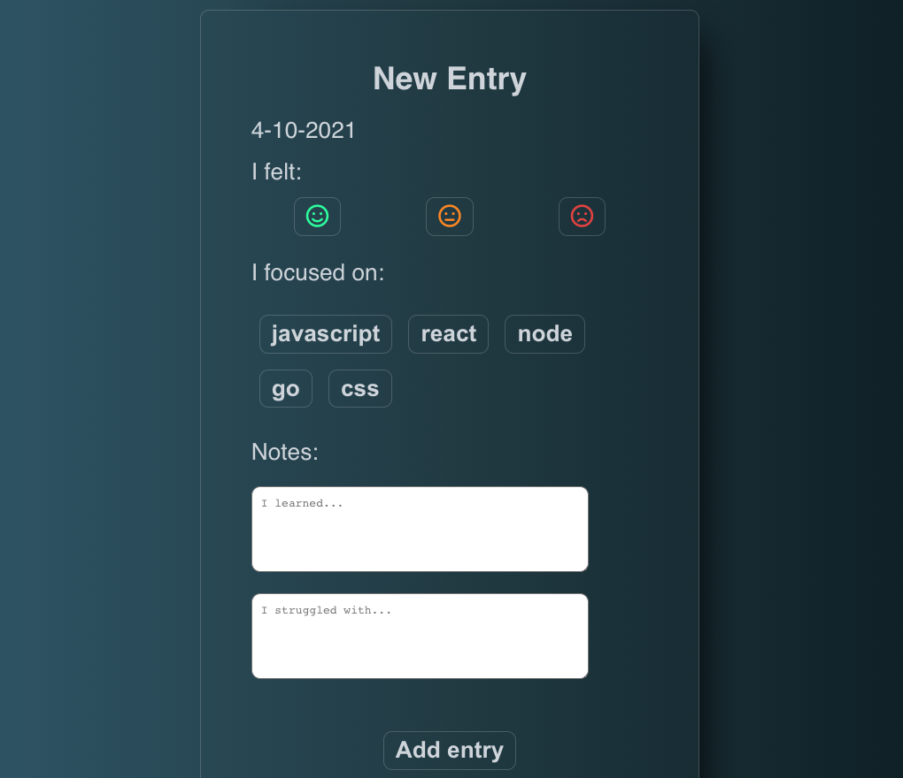

# My Learning Stack
My Learning Stack is a journaling app for developers.

Enter your mood, your focus of the day,
what you've learned, what you've struggled with,
and keep track of all your progress!

## Screenshots

**Enter a new note**

**View all your entries in your dashboard**

**View the details and/or delete your note**

**Update your profile**

## Features to come:
* GitHub-like graph to better visualize your entries
* Setting-up reminders 
* Possibility to add more notes categories (like feedback)

## Built with
* React
* Javascript
* CSS
* HTML

## Live App
- [Click here](https://my-learning-stack-app.vercel.app/)
